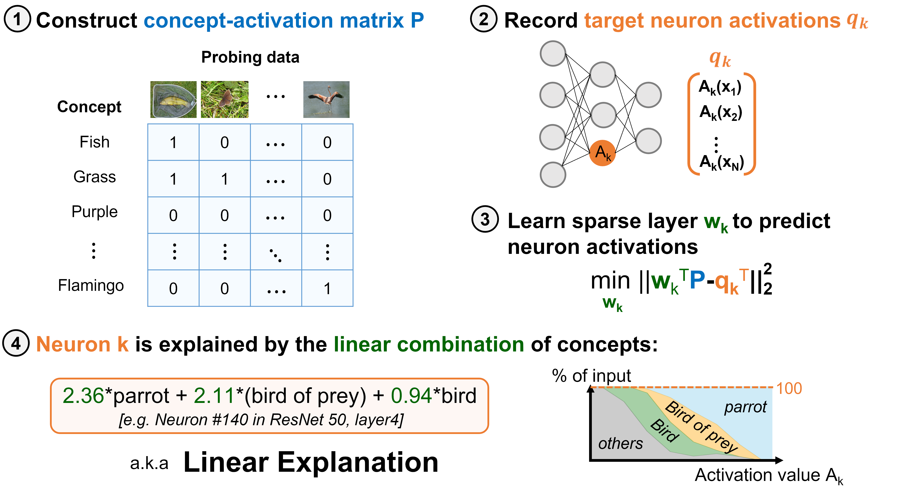
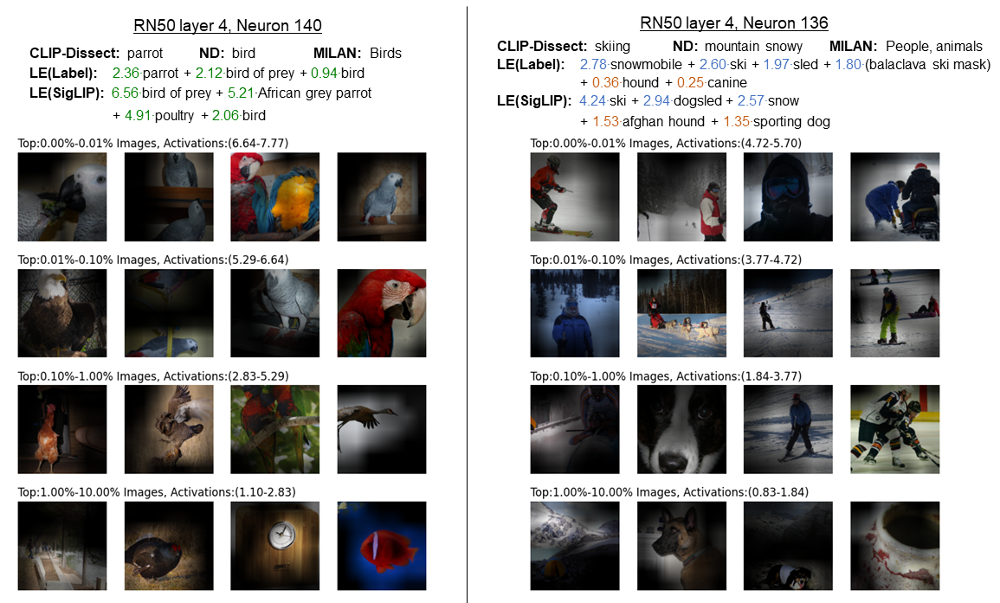

# Linear Explanations for Individual Neurons
This is the official repository for our paper ICML 2024 *Linear Explanations for Individual Neurons*. [[Arxiv link]](https://arxiv.org/abs/2405.06855).

We propose that neurons are best understood as linear combinations of interpretable concepts, and propose an efficient way to generate such explanations: Linear Explanations (LE). In addition we introduce the *simulation* evaluation for vision models.

### Method Overview


## Setup

1. Install Python (3.11) and Pytorch (>=2.0) with torchvision: https://pytorch.org/get-started/locally/
2. Install other dependencies with `pip install -r requirements.txt`
3. To analyze ResNet-18 trained on Places365, download it with `bash download_rn18_places.sh`
4. To use ImageNet models/data, add the path to your folder containing ImageNet validation data to `DATASET_ROOTS` in `data_utils.py`

## Running

### Quickstart

- Explain neurons in VGG-16(CIFAR100) using LE(Label):

`python explain_neurons.py --target_name vgg16_bn_cifar100 --target_layer classifier[4] --dataset_name cifar100_val`

- Explain neurons in ResNet-18(Places365) using LE(SigLIP):

`python explain_neurons.py --target_name resnet18_places365 --target_layer layer4 --pool_mode avg --dataset_name places365_val --mode siglip`

- Evaluate our LE(SigLIP) explanations of ResNet-18(Places365) with Simulation(Correlation scoring):

`python simulate_correlation.py --target_name resnet18_places365 --target_layer layer4 --pool_mode avg --dataset_name places365_val --explanation_method le_siglip`

- Evaluate our LE(Label) explanations of ResNet-50(ImageNet) with Simulation(Ablation scoring):

`python simulate_ablation.py`

For additional commands and instructions for reproducing our experiments, see `commands.txt`.

## Results

### Simulation results (correlation scoring)


| Target model              | Network <br> Dissection | MILAN  | CLIP-Dissect | LE (Label) | LE (SigLIP) |
|---------------------------|------------------------|--------|--------------|------------|-------------|
| ResNet-50 (ImageNet)  | 0.1242                 | 0.0920 | 0.1871       | 0.2924     | **0.3772**  |
| ResNet-18 (Places365) | 0.2038                 | 0.1557 | 0.2208       | 0.3388     | **0.4372**  |
| VGG-16 (CIFAR-100)    | -                      | -      | 0.2298       | 0.4330     | **0.4970**  |
| ViT-B/16 (ImageNet)   | -                      | -      | 0.1722       | 0.3243     | **0.3489**  |
| ViT-L/32 (ImageNet)   | -                      | -      | 0.0549       | 0.1879     | **0.2182**  |

Average correlation scores for different explanation methods in seconds to last layer of the different models.

### Example results



## Sources

GLM-Saga: https://github.com/MadryLab/glm_saga

RN18(Places365) model: https://github.com/CSAILVision/NetDissect-Lite

CIFAR models: https://github.com/chenyaofo/pytorch-cifar-models

CLIP models: https://github.com/mlfoundations/open_clip

## Cite this work
T. Oikarinen and T.W. Weng, Linear Explanations for Individual Neurons, ICML 2024.

```
@inproceedings{oikarinen2024linear,
  title={Linear Explanations for Individual Neurons},
  author={Oikarinen, Tuomas and Weng, Tsui-Wei},
  booktitle={International Conference on Machine Learning},
  year={2024}
}
```